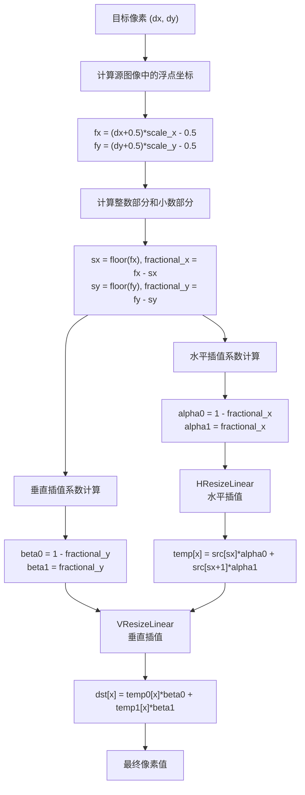

# Resize

## 介绍

包含以下内容：

- [x] resize_align_kernel (opencv f32 resize cuda版本)
- [x] resize_u8_align_kernel (opencv u8 resize cuda版本)
- [x] resize_align_2D_kernel (2D布局版本)
- [x] resize_align_shared_kernel (共享内存版本)

## 测试

硬件：

- cpu: Intel(R) Core(TM) i9-9900K CPU @ 3.60GHz
- gpu: NVIDIA GeForce RTX 4090 D

运行：

```bash
# 只测试Ada架构 不指定默认编译所有架构 耗时较长: Volta, Ampere, Ada, Hopper, ...
export TORCH_CUDA_ARCH_LIST=Ada
python3 img_resize.py
```


输出：

```
-------------------------------------------------------------------------------------
                                        H=2048, W=1024, S=0.3
-------------------------------------------------------------------------------------
                                        dH=614, dW=307, ch=1
-------------------------------------------------------------------------------------
      out_f32_align_float: passed: 1e-3, 1e-3: 0%, 1e-6: 91.6%, max_diff: 0.00028586, iters: 1000, time: 9.3081ms, avg: 0.0093ms
     out_f32_align_double: passed: 1e-6, 1e-3: 0%, 1e-6: 0%, max_diff: 4.7683716e-07, iters: 1000, time: 15.2957ms, avg: 0.0153ms
       out_u8_align_float: passed: 1e0, 1e-3: 12.8%, 1e-6: 12.8%, max_diff: 1.0, iters: 1000, time: 9.1445ms, avg: 0.0091ms
      out_u8x_align_float: passed: 1e0, 1e-3: 0.903%, 1e-6: 0.903%, max_diff: 1.0, iters: 1000, time: 7.5030ms, avg: 0.0075ms
      out_u8_align_double: passed: 1e0, 1e-3: 12.8%, 1e-6: 12.8%, max_diff: 1.0, iters: 1000, time: 15.2724ms, avg: 0.0153ms
-------------------------------------------------------------------------------------
                                        dH=614, dW=307, ch=3
      out_f32_align_float: passed: 1e-3, 1e-3: 0%, 1e-6: 91.6%, max_diff: 0.00031871, iters: 1000, time: 10.3722ms, avg: 0.0104ms
     out_f32_align_double: passed: 1e-6, 1e-3: 0%, 1e-6: 0%, max_diff: 4.7683716e-07, iters: 1000, time: 24.8456ms, avg: 0.0248ms
       out_u8_align_float: passed: 1e0, 1e-3: 12.8%, 1e-6: 12.8%, max_diff: 1.0, iters: 1000, time: 9.7516ms, avg: 0.0098ms
      out_u8x_align_float: passed: 1e0, 1e-3: 0.949%, 1e-6: 0.949%, max_diff: 1.0, iters: 1000, time: 8.0528ms, avg: 0.0081ms
      out_u8_align_double: passed: 1e0, 1e-3: 12.8%, 1e-6: 12.8%, max_diff: 1.0, iters: 1000, time: 24.5132ms, avg: 0.0245ms
-------------------------------------------------------------------------------------
-------------------------------------------------------------------------------------
                                        H=2048, W=1024, S=0.5
-------------------------------------------------------------------------------------
                                        dH=1024, dW=512, ch=1
-------------------------------------------------------------------------------------
      out_f32_align_float: passed: 1e-6, 1e-3: 0%, 1e-6: 0%, max_diff: 2.3841858e-07, iters: 1000, time: 17.3192ms, avg: 0.0173ms
     out_f32_align_double: passed: 1e-6, 1e-3: 0%, 1e-6: 0%, max_diff: 2.3841858e-07, iters: 1000, time: 31.5096ms, avg: 0.0315ms
       out_u8_align_float: passed: 1e-8, 1e-3: 0%, 1e-6: 0%, iters: 1000, time: 17.0338ms, avg: 0.0170ms
      out_u8x_align_float: passed: 1e-8, 1e-3: 0%, 1e-6: 0%, iters: 1000, time: 13.3405ms, avg: 0.0133ms
      out_u8_align_double: passed: 1e-8, 1e-3: 0%, 1e-6: 0%, iters: 1000, time: 31.2657ms, avg: 0.0313ms
-------------------------------------------------------------------------------------
                                        dH=1024, dW=512, ch=3
      out_f32_align_float: passed: 1e-6, 1e-3: 0%, 1e-6: 0%, max_diff: 2.3841858e-07, iters: 1000, time: 19.6886ms, avg: 0.0197ms
     out_f32_align_double: passed: 1e-6, 1e-3: 0%, 1e-6: 0%, max_diff: 2.3841858e-07, iters: 1000, time: 53.1054ms, avg: 0.0531ms
       out_u8_align_float: passed: 1e-8, 1e-3: 0%, 1e-6: 0%, iters: 1000, time: 18.2581ms, avg: 0.0183ms
      out_u8x_align_float: passed: 1e-8, 1e-3: 0%, 1e-6: 0%, iters: 1000, time: 14.4615ms, avg: 0.0145ms
      out_u8_align_double: passed: 1e-8, 1e-3: 0%, 1e-6: 0%, iters: 1000, time: 52.0914ms, avg: 0.0521ms
-------------------------------------------------------------------------------------
-------------------------------------------------------------------------------------
                                        H=2048, W=1024, S=0.9
-------------------------------------------------------------------------------------
                                        dH=1843, dW=921, ch=1
-------------------------------------------------------------------------------------
      out_f32_align_float: passed: 1e-3, 1e-3: 0%, 1e-6: 91.6%, max_diff: 0.00034061, iters: 1000, time: 50.7672ms, avg: 0.0508ms
     out_f32_align_double: passed: 1e-6, 1e-3: 0%, 1e-6: 0%, max_diff: 7.1525574e-07, iters: 1000, time: 98.5177ms, avg: 0.0985ms
       out_u8_align_float: passed: 1e0, 1e-3: 12.8%, 1e-6: 12.8%, max_diff: 1.0, iters: 1000, time: 49.2649ms, avg: 0.0493ms
      out_u8x_align_float: passed: 1e0, 1e-3: 0.91%, 1e-6: 0.91%, max_diff: 1.0, iters: 1000, time: 37.2005ms, avg: 0.0372ms
      out_u8_align_double: passed: 1e0, 1e-3: 12.8%, 1e-6: 12.8%, max_diff: 1.0, iters: 1000, time: 97.4231ms, avg: 0.0974ms
-------------------------------------------------------------------------------------
                                        dH=1843, dW=921, ch=3
      out_f32_align_float: passed: 1e-3, 1e-3: 0%, 1e-6: 91.6%, max_diff: 0.00044417, iters: 1000, time: 56.9334ms, avg: 0.0569ms
     out_f32_align_double: passed: 1e-6, 1e-3: 0%, 1e-6: 0%, max_diff: 4.7683716e-07, iters: 1000, time: 169.8885ms, avg: 0.1699ms
       out_u8_align_float: passed: 1e0, 1e-3: 12.8%, 1e-6: 12.8%, max_diff: 1.0, iters: 1000, time: 53.1290ms, avg: 0.0531ms
      out_u8x_align_float: passed: 1e0, 1e-3: 0.923%, 1e-6: 0.923%, max_diff: 1.0, iters: 1000, time: 40.7715ms, avg: 0.0408ms
      out_u8_align_double: passed: 1e0, 1e-3: 12.8%, 1e-6: 12.8%, max_diff: 1.0, iters: 1000, time: 166.1856ms, avg: 0.1662ms
-------------------------------------------------------------------------------------
-------------------------------------------------------------------------------------
                                        H=2048, W=1024, S=1.7
-------------------------------------------------------------------------------------
                                        dH=3481, dW=1740, ch=1
-------------------------------------------------------------------------------------
      out_f32_align_float: passed: 1e-3, 1e-3: 0%, 1e-6: 91.6%, max_diff: 0.00042892, iters: 1000, time: 170.4488ms, avg: 0.1704ms
     out_f32_align_double: passed: 1e-6, 1e-3: 0%, 1e-6: 0%, max_diff: 7.1525574e-07, iters: 1000, time: 336.4842ms, avg: 0.3365ms
       out_u8_align_float: passed: 1e0, 1e-3: 12.9%, 1e-6: 12.9%, max_diff: 1.0, iters: 1000, time: 164.4461ms, avg: 0.1644ms
      out_u8x_align_float: passed: 1e0, 1e-3: 0.943%, 1e-6: 0.943%, max_diff: 1.0, iters: 1000, time: 122.1719ms, avg: 0.1222ms
      out_u8_align_double: passed: 1e0, 1e-3: 12.9%, 1e-6: 12.9%, max_diff: 1.0, iters: 1000, time: 331.8367ms, avg: 0.3318ms
-------------------------------------------------------------------------------------
                                        dH=3481, dW=1740, ch=3
      out_f32_align_float: passed: 1e-3, 1e-3: 0%, 1e-6: 91.6%, max_diff: 0.00039625, iters: 1000, time: 216.5644ms, avg: 0.2166ms
     out_f32_align_double: passed: 1e-6, 1e-3: 0%, 1e-6: 0%, max_diff: 7.1525574e-07, iters: 1000, time: 609.5953ms, avg: 0.6096ms
       out_u8_align_float: passed: 1e0, 1e-3: 12.8%, 1e-6: 12.8%, max_diff: 1.0, iters: 1000, time: 177.1469ms, avg: 0.1771ms
      out_u8x_align_float: passed: 1e0, 1e-3: 0.937%, 1e-6: 0.937%, max_diff: 1.0, iters: 1000, time: 134.4893ms, avg: 0.1345ms
      out_u8_align_double: passed: 1e0, 1e-3: 12.8%, 1e-6: 12.8%, max_diff: 1.0, iters: 1000, time: 571.2829ms, avg: 0.5713ms
-------------------------------------------------------------------------------------
-------------------------------------------------------------------------------------
                                        H=2048, W=1024, S=2.0
-------------------------------------------------------------------------------------
                                        dH=4096, dW=2048, ch=1
-------------------------------------------------------------------------------------
      out_f32_align_float: passed: 1e-6, 1e-3: 0%, 1e-6: 0%, max_diff: 4.7683716e-07, iters: 1000, time: 236.1636ms, avg: 0.2362ms
     out_f32_align_double: passed: 1e-6, 1e-3: 0%, 1e-6: 0%, max_diff: 4.7683716e-07, iters: 1000, time: 466.2325ms, avg: 0.4662ms
       out_u8_align_float: passed: 1e0, 1e-3: 9.38%, 1e-6: 9.38%, max_diff: 1.0, iters: 1000, time: 226.2299ms, avg: 0.2262ms
      out_u8x_align_float: passed: 1e0, 1e-3: 0.013%, 1e-6: 0.013%, max_diff: 1.0, iters: 1000, time: 167.7585ms, avg: 0.1678ms
      out_u8_align_double: passed: 1e0, 1e-3: 9.38%, 1e-6: 9.38%, max_diff: 1.0, iters: 1000, time: 458.2818ms, avg: 0.4583ms
-------------------------------------------------------------------------------------
                                        dH=4096, dW=2048, ch=3
      out_f32_align_float: passed: 1e-6, 1e-3: 0%, 1e-6: 0%, max_diff: 4.7683716e-07, iters: 1000, time: 305.9549ms, avg: 0.3060ms
     out_f32_align_double: passed: 1e-6, 1e-3: 0%, 1e-6: 0%, max_diff: 4.7683716e-07, iters: 1000, time: 850.4057ms, avg: 0.8504ms
       out_u8_align_float: passed: 1e0, 1e-3: 9.38%, 1e-6: 9.38%, max_diff: 1.0, iters: 1000, time: 243.8421ms, avg: 0.2438ms
      out_u8x_align_float: passed: 1e0, 1e-3: 0.0121%, 1e-6: 0.0121%, max_diff: 1.0, iters: 1000, time: 184.9124ms, avg: 0.1849ms
      out_u8_align_double: passed: 1e0, 1e-3: 9.38%, 1e-6: 9.38%, max_diff: 1.0, iters: 1000, time: 789.8536ms, avg: 0.7899ms
-------------------------------------------------------------------------------------
-------------------------------------------------------------------------------------
                                        H=2048, W=1024, S=2.4
-------------------------------------------------------------------------------------
                                        dH=4915, dW=2457, ch=1
-------------------------------------------------------------------------------------
      out_f32_align_float: passed: 1e-3, 1e-3: 0%, 1e-6: 91.5%, max_diff: 0.00038743, iters: 1000, time: 345.4421ms, avg: 0.3454ms
     out_f32_align_double: passed: 1e-6, 1e-3: 0%, 1e-6: 0%, max_diff: 7.1525574e-07, iters: 1000, time: 676.2965ms, avg: 0.6763ms
       out_u8_align_float: passed: 1e0, 1e-3: 12.8%, 1e-6: 12.8%, max_diff: 1.0, iters: 1000, time: 324.6541ms, avg: 0.3247ms
      out_u8x_align_float: passed: 1e0, 1e-3: 0.933%, 1e-6: 0.933%, max_diff: 1.0, iters: 1000, time: 240.2000ms, avg: 0.2402ms
      out_u8_align_double: passed: 1e0, 1e-3: 12.8%, 1e-6: 12.8%, max_diff: 1.0, iters: 1000, time: 657.8226ms, avg: 0.6578ms
-------------------------------------------------------------------------------------
                                        dH=4915, dW=2457, ch=3
      out_f32_align_float: passed: 1e-3, 1e-3: 0%, 1e-6: 91.5%, max_diff: 0.00041914, iters: 1000, time: 447.7983ms, avg: 0.4478ms
     out_f32_align_double: passed: 1e-6, 1e-3: 0%, 1e-6: 0%, max_diff: 7.1525574e-07, iters: 1000, time: 1231.3817ms, avg: 1.2314ms
       out_u8_align_float: passed: 1e0, 1e-3: 12.8%, 1e-6: 12.8%, max_diff: 1.0, iters: 1000, time: 349.4389ms, avg: 0.3494ms
      out_u8x_align_float: passed: 1e0, 1e-3: 0.933%, 1e-6: 0.933%, max_diff: 1.0, iters: 1000, time: 264.6241ms, avg: 0.2646ms
      out_u8_align_double: passed: 1e0, 1e-3: 12.8%, 1e-6: 12.8%, max_diff: 1.0, iters: 1000, time: 1130.3849ms, avg: 1.1304ms
-------------------------------------------------------------------------------------
```

## FAQ

### 为什么计算 `src_x` 和 `src_y` 时先 +0.5 再 -0.5 ？

```c++
    const float fx = (float)src_width / dst_width;
    const float fy = (float)src_height / dst_height;
    const float src_x = (dst_x + 0.5) * fx - 0.5;
    const float src_y = (dst_y + 0.5) * fy - 0.5;
```

**在做缩放/插值时，按中心对齐更精确，可以避免图像整体偏移半个像素**


1. 为什么 +0.5 ？

    像素通常认为是一个 小方格，而不是一个点。在 OpenCV / CUDA 里，像素通常这样定义：

    - (dst_x, dst_y) 是目标图像像素的左上角坐标
    - (dst_x + 0.5, dst_y + 0.5) 是目标像素的中心坐标

2. 缩放比例

    - `fx = (float)src_width / dst_width`
    - `fy = (float)src_height / dst_height`

3. 为什么 -0.5 ？

    因为我们一开始是用目标像素的“中心”坐标去推算源图的位置，在源图里，也要保持“中心对齐”，所以需要再平移 -0.5，保证源图和目标图的像素中心对齐

如果我们不减 0.5，情况是这样的：


#### 4x4 -> 2x2 

源图中心坐标 (4×4)

```
(0.5,0.5)  (1.5,0.5)  (2.5,0.5)  (3.5,0.5)
(0.5,1.5)  (1.5,1.5)  (2.5,1.5)  (3.5,1.5)
(0.5,2.5)  (1.5,2.5)  (2.5,2.5)  (3.5,2.5)
(0.5,3.5)  (1.5,3.5)  (2.5,3.5)  (3.5,3.5)
```

目标中心坐标 (2×2)

```
(0.5,0.5)   (1.5,0.5)
(0.5,1.5)   (1.5,1.5)
```

按照

```
src_x = (dst_x + 0.5) * fx 
src_y = (dst_y + 0.5) * fy
```


目标像素中心 (0.5, 0.5) → 源图坐标 (0.5 * scale, 0.5 * scale)。fx = 2（缩放 2 倍）：就得到源图坐标 (1.0, 1.0)。但是源图的第一个像素的中心应该在 (0.5, 0.5)，这样就出现 整体平移了 0.5 个像素。

目标像素中心 (1.5, 1.5) → 源图坐标 (1.5 * scale, 1.5 * scale)。就得到源图坐标 (3.0, 3.0)。但是源图的像素的中心应该在 (2.5, 2.5)，


按照

```
src_x = (dst_x + 0.5) * fx - 0.5
src_y = (dst_y + 0.5) * fy - 0.5
```

目标像素 (0.5,0.5) 对应到源图的 (0.5, 0.5)
目标像素 (1.5,1.5) 对应到源图的 (1.5, 1.5)


#### 2x2 -> 4x4 

源图中心坐标 (2×2)

```
(0.5,0.5)   (1.5,0.5)
(0.5,1.5)   (1.5,1.5)
```

目标中心坐标 (4×4)

```
(0.5,0.5)  (1.5,0.5)  (2.5,0.5)  (3.5,0.5)
(0.5,1.5)  (1.5,1.5)  (2.5,1.5)  (3.5,1.5)
(0.5,2.5)  (1.5,2.5)  (2.5,2.5)  (3.5,2.5)
(0.5,3.5)  (1.5,3.5)  (2.5,3.5)  (3.5,3.5)
```

目标的像素要靠 插值 去“采样”源图附近的像素，结果可能落在边界外，需要 边界处理。

- 目标像素中心 (0.5, 0.5) → 源图坐标 (-0.25, -0.25)。


#### opencv 原理




### 共享内存版本慢很多？

访存特性决定了共享内存不一定有收益

- 原始版本的核函数每个线程只需要访问 4 个源像素 (v1,v2,v3,v4)，访问量极少，而且是高度规则的全局内存访问。
- 这类访问模式 GPU 的 L1/L2 cache 已经能很好地缓存（特别是连续读行时）。

共享内存更适合 卷积/滤波 这类情况：同一个源像素会被多个线程复用。但双线性插值时，每个线程几乎独享那几个像素 → 复用度低。

bank conflict 和动态共享内存开销

- 用 `tile[(ty * tileW + tx) * CH + c]` 这样的 layout，如果 CH 不是 1 的话，容易出现 shared memory bank conflict（尤其是 CH=3 的情况）

